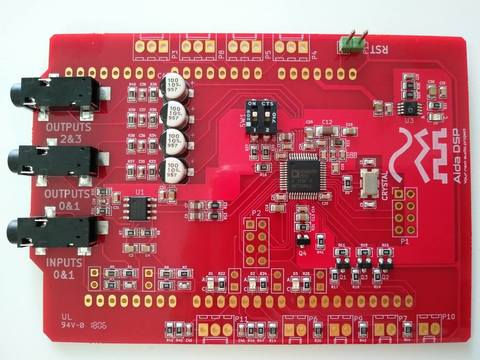

## Aida DSP Arduino Shield

### What is it?

Aida DSP is an audio shield for Arduino for those who wants to implement their own audio effects without compromises on the sound quality.

In addition, it can be used as a platform in _**STEM**_ courses to teach engineering and digital signal processing.

### Specs
- Pro audio A/D D/A conversion: 24 bits, 48/96/192kHz
- Compact design size (Arduino shield form factor)
- Low noise design for audio applications
- Low latency less than 1ms guaranteed
- 2 mono inputs 4 mono outputs
- Dedicated crimpable connectors to host encoder, buttons and pots
- Expansion connector with available signals from DSP
- Available open source examples for Arduino boards
- Compatible with Arduino Uno/Mega/Due/Zero

### How it works

1. DSP firmware
> > The DSP firmare is developed in Sigma Studio, a proprietary tool which implements an intuitive graphical design workflow. From Sigma Studio you can export an .xml file which contains DSP firmware and then with our [Java tool](https://github.com/AidaDSP/AidaDSP/tree/master/Software/Java/AidaHeaderFileGenerator/bin) you can generate a C header file to be used in the Arduino IDE.

2. Arduino sketch
> > With the help of the auto-generated code, it's easier to develop a sketch that communicates with the DSP in real time to control its algorithm using [Aida DSP Arduino library](https://github.com/AidaDSP/AidaDSP/tree/master/Software/Libraries).

3. Create!
> > Now you can manage your UI (user interface: buttons, faders, etc.) with Arduino and then let the DSP do the whole hard work of processing audio. For example you can use the DSP to generate a sine tone and change its frequency and amplitude with a pot wired to Arduino's analog input. Check out our [examples](https://github.com/AidaDSP/AidaDSP/tree/master/Software/Examples) on Github!

### Typical applications
- 1st and 2nd order equalizers with adjustable f, Q, gain
- Processors with peak or rms detection for monochannel
  and multichannel dynamics
- Mixers and splitters
- Tone and noise generators
- Fixed and variable gain
- Loudness
- Delay
- Stereo enhancement
- Dynamic bass boost
- FIR & IIR filters
- Level detectors
- GPIO control and conditioning
- Special function to update DSP parameters in real-time without clicks and pops
- More...

### More info

- [Examples](https://github.com/AidaDSP/AidaDSP/tree/master/Software/Examples)
- [Arduino Libraries](https://github.com/AidaDSP/AidaDSP/tree/master/Software/Libraries)
- [Java Tools](https://github.com/AidaDSP/AidaDSP/tree/master/Software/Java)
- [Hardware specs & additional informations](https://github.com/AidaDSP/AidaDSP/tree/master/Hardware)
- [Wiki](https://github.com/AidaDSP/AidaDSP.github.io/wiki)
- **Where to BUY:** [Tindie](https://www.tindie.com/products/Maxdsp/aida-dsp-arduino-shield/)
- [Follow us on **Facebook**](https://www.facebook.com/official.AidaDSP)

### Partners

**Manufacturing:**

[Go to the Home Page]({{ '/' | absolute_url }})
