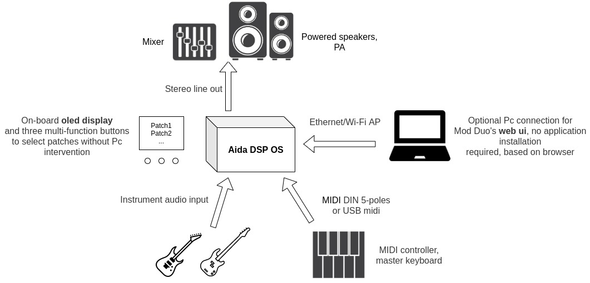
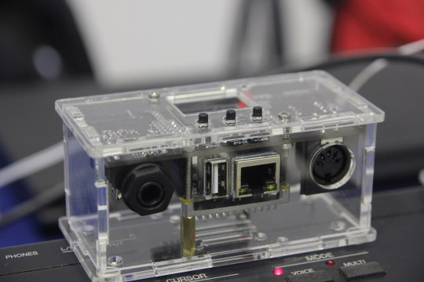
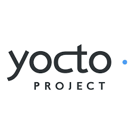

## Aida DSP OS

### What is it?

Aida DSP OS is a portable standalone synthesizer and digital effect processor based on _Linux_ and other open source software

### How it works?

First, you need to choose between 3+ operating modes. The current modes are:

* _**Sampler/soundfont player**_ (i.e. you can play a piano/synth with your midi keyboard/controller) 
* _**Mod Duo &reg; pedalboard player**_ (i.e. you attach a guitar/bass and you build your own virtual pedalboard using the plugins installed and
connecting them together in a total free way)
* _**Puredata patch player**_ (i.e. you select and load a pd patch previously builded on your Pc)
* _**Combo mode**_ (soundfont player with Mod Duo &reg; pedalboard in cascade)

The board is shipped with _**Mod Duo &reg; pedalboard player**_ mode as default. You can change board settings by simply editing a text file.

### Connections example

### Features
  
1. In/Out
  * optoisolated midi input (connect directly keyboards, synths)
  * usb host port for usb midi controllers
  * high impedance instrument input (guitar/bass) (6.5mm jack)
  * stereo line out (3.5mm jack)
2. Control
  * high contrast oled display
  * three micro switches
  * connect usb to a Pc to copy samples or custom plugins (usb storage mode)
3. Performance
  * quad core cortex A53 processor with 1GB of ram
  * audio codec 24bit/48/96/192kHz
  * 64-bit internal processing
  * 32GB sd card (class 10 95MB/s read speed)

### What's included

Aida DSP OS comes fully assembled with acrylic (transparent) case and require no soldering work. Included in the software
package:
- 3,8GB of samples ready to play in soundfonts player mode see [samples list](https://drive.google.com/drive/folders/11b5uSavJboytXnDFgocN8cjFrTf7xIc7?usp=sharing)
- 430 lv2 plugins see [plugins list](https://drive.google.com/drive/folders/11b5uSavJboytXnDFgocN8cjFrTf7xIc7?usp=sharing)
- puredata version 0.49-0 with examples [puredata audio examples](https://drive.google.com/drive/folders/11b5uSavJboytXnDFgocN8cjFrTf7xIc7?usp=sharing)

### Advantages

- High definition audio codec with ultra low noise clock source
- RT Preempt kernel means low and stable audio latency (10ms or less).
- Operative system realized with Yocto means higher system stability: no unuseful software
is installed on the board (this board is not running _Raspbian_ or _Ubuntu_ or _Armbian_ or a whatsoever general purpose distribution). Aida DSP OS
is a custom distribution and the focus of the project is obtaining the best performance for audio processing/synthesis.
- Intelligent partitioning: the sd card is partitioned with all the plugins, samples and patches in the same FAT32 partition, so that
can be easily mounted and accessed also by non-linux systems. This also saves from messing up the core filesystem that would prevent the board's booting.
- Reliable operation: no write on the core filesystem is performed during operation (prevents sd card damage). Logs are stored in RAM and rotated in a safe way hourly.
- Based on open source software:
  * create your soundfont in SFZ format. How-to [here]({{ '/howto_make_your_own_sfz_soundfont.html' | absolute_url }})
  * develop your own plugin using the sdk provided. How-to [here]({{ '/howto_sdk_lv2_plugins.html' | absolute_url }})
  * create your own patch with puredata
- Ease of operation: when started in usb storage mode, the board can be connected with USB cable to a Pc for transferring new samples, plugins or patches.

### Not included

- Power supply: 5V/2A. You can use a standard 2A phone charger with micro USB connector, or a [Raspberry Pi's adapter](https://www.amazon.it/Aukru-Alimentatore-Raspberry-modello-Modello/dp/B01566WOAG/ref=sr_1_8?__mk_it_IT=%C3%85M%C3%85%C5%BD%C3%95%C3%91&keywords=raspberry+pi+supply&qid=1569943965&s=gateway&sr=8-8). Power banks for mobile phones also work very well and help avoiding ground loops.
- Midi/audio cables
- [WiFi usb dongle](https://www.amazon.it/D-Link-DWA-121-Adattatore-Wireless-Antracite/dp/B004X8R7HY/ref=sr_1_5?__mk_it_IT=%C3%85M%C3%85%C5%BD%C3%95%C3%91&keywords=d-link%20usb%20wifi&qid=1584376986&sr=8-5&swrs=B3D668556947E065B2CE782FAA97C263&fbclid=IwAR0Vr2L_k0_AUy2j_GJnvZMGryFhYNdQ8MEbCz_ExXT1v740eG5xbv9u0pg) or another one with the same chip

### Dimensions

- width 10,61 cm
- height 4,93 cm
- length 5,21 cm

### Weight

- 0,144 g

### Resources

- [Quick start]()
- [User Manual]({{ '/aida_dsp_os_manual.html' | absolute_url }})
- **Where to BUY:** [Tindie](https://www.tindie.com/products/Maxdsp/aida-dsp-os/)
- [SDK](https://drive.google.com/drive/folders/1hVDwNKM-71I9deZ_zFdNpo2buZoSFEat?usp=sharing)
- [SD Image V1.00]()
- [SD Image V1.01]()

### Media

- [Gallery]()
- [Video 1: Rhodes piano](https://www.youtube.com/watch?v=kfzPL0KXjlY)
- [Video 2: Live usage with a loop station](https://www.youtube.com/watch?v=8az4FD6caq4)
- [Sampler mode](https://www.youtube.com/channel/UCHDkEU3hgz7rVfUCDqRAoJQ)
- [Mod Duo &reg; mode](https://www.youtube.com/channel/UCHDkEU3hgz7rVfUCDqRAoJQ)
- [Puredata mode](https://www.youtube.com/channel/UCHDkEU3hgz7rVfUCDqRAoJQ)

### Powered by

### Partners

**Manufacturing:**

### Credits

Aida DSP OS wouldn't exist without open source software. We want to actively endorse and contribute to the open source community and we're always looking for the best options to do so.

We're not directly affiliated with **Moddevices**. All product and company names are the registered trademarks of their original owners.

[Go to the Home Page]({{ '/' | absolute_url }})
