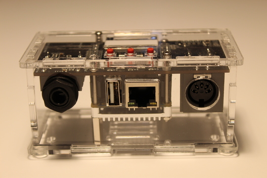
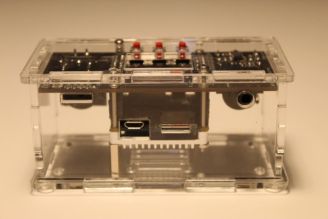
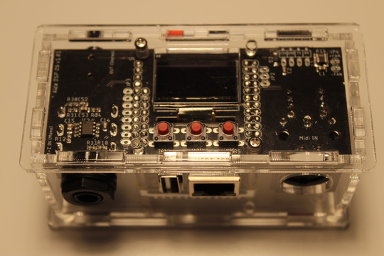
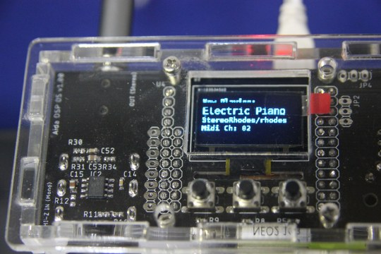
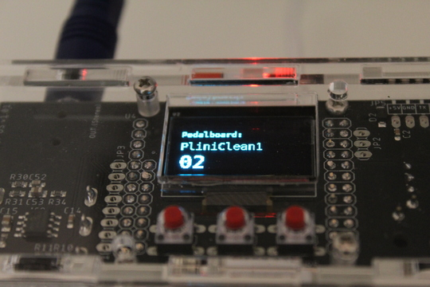

# Aida DSP OS User Manual

## Connections





1. Front panel, from left to right
  * input audio mono (6.5mm jack, high impedance)
  * USB host port for USB midi devices (USB type A female connector)
  * Ethernet port (RJ-45 socket)
  * midi in (standard 5 poles din connector optoisolated)

2. Back panel, from left to right
  * uart port (4 pin pinheader connector, arduino nano pinout )
  * USB micro supply port
  * SD-Card slot
  * output audio stereo (3.5mm jack, line level)
3. Top panel
  * OLED Display
  * three buttons: K1 (left), K2 (center), K3 (right)

## Glossary

* _**hmi**_: human machine interface. On Aida DSP OS it's made with an OLED display and three buttons
* _**plugin**_: an audio effect
* ...

## Usage

### Power on

To power on Aida DSP OS, connect _**USB micro supply port**_ to a proper supply source. Compatible sources are

1. Mobile phone adapter (verify it's at least 2A)
2. Mobile phone power bank
3. Raspberry Pi power adapter
4. The USB port of your laptop Pc (you'll need a male USB micro to female USB type-A cable)

### USB mass storage mode

In this mode Aida DSP OS can be connected to a Pc for transferring files or change default system configuration.

---
**NOTE**

You need a USB micro to female USB type-A _**data**_ cable. Please verify it's a data cable! To check the cable
count how many metal contacts has the male USB micro connector in the cable. If only two it's a supply only cable, you need the one
with _**all**_ the contacts

---

1. Connect USB back supply port to Pc with a USB data cable and press central button (K2)
2. On Aida DSP OS' display should appear "USB mass storage mode"
3. In your Pc explore the new usb mass storage device
4. Open file under .config/config with a simple text editor
5. Customize the file

The configuration file is sort of [INI file](https://en.wikipedia.org/wiki/INI_file). If you don't know
what is it an INI file don't worry and read the following, otherwise skip

```
INI files are organized in lines, if the line doesn't start with a ';', a '#' or a '['
then it's a valid line.
A valid line is used to specify a configuration. Example:

mode mod-duo

means the default startup mode for Aida DSP OS is Mod Duo mode. You can change it to

mode sampler

or

mode puredata

to start the board respectively in soundfont player mode or puredata mode.

```

When you finished to edit the configuration file, save it before exit and restart the board with a power cycle (this time no button press is necessary).

Aida DSP OS should now start with the new configuration active.

### How files are organized in the exposed partition

```
.
├── .config
├── .lv2plugins
├── .oldlogs
├── .pedalboards
├── .puredata
└── .soundfonts
```

* _**.config**_ contains the config file that stores system settings
* _**.lv2plugins**_ contains all the lv2 plugins installed on the board
* _**.oldlogs**_ contains all the relevant logs both from system and applications (logs are rotated every hour)
* _**.pedalboards**_ contains all the Mod Duo pedalboards
* _**.puredata**_ contains all the pd patches
* _**.soundfonts**_ contains all the sounfonts installed on the board

### Adding a soundfont

Soundfonts are organized in folders by format and instrument type:

```
.
├── gig
│   ├── Mellotron
│   └── Yamaha CF3
├── sf2
│   ├── FluidR3_GM.sf2
│   ├── FluidR3_GS.sf2
│   └── TimGM6mb.sf2
└── sfz
    ├── Bass
    ├── Brass
    ├── Drum Machines
    ├── Drums
    ├── Ethnic
    ├── Guitars
    ├── Organs
    ├── Other
    ├── Percussion
    ├── Pianos
    ├── Strings
    ├── Synths
    └── Woodwinds
```

Suppose you have a new soundfont called _**Piano1**_ and structured like that

```
└── Piano1
    ├── Samples
    │   ├── 1_A_a.wav
    │   ├── 1_Ab_b.wav
    │   └── ...
    └── Piano1.sfz
```

In _Samples_ you'll likely to see many .wav files or just one depending on how the soundfont has been created. Mine is just an example.

To copy this new soundfont to Aida DSP OS you need to copy all the _Piano1_ folder under

.soundfonts/sfz/Pianos

but it will also work in a new path like

.soundfonts/sfz/MySamples

### Buttons behaviour in hmi

K1, K2 and K3 are managed as time controlled buttons. Exact behaviour depends on the mode and the page where you are: the first
page displayed in a mode after power on is the home.

### Soundfont player mode

When started in this mode, Aida DSP OS is usable as a soundfont player. Soundfont is a sample-based synthesis controlled via midi.

In the simplest scenario, you play the midi keyboard and the midi notes are synthesized inside Aida DSP OS with the sound of the instrument
that you selected: a piano, an organ, a mellotron...

On Aida DSP OS you have nearly ~4GB of instruments to choose with. You can view the list [here](https://drive.google.com/drive/folders/11b5uSavJboytXnDFgocN8cjFrTf7xIc7?usp=sharing).

The hmi in this mode lets you select the soundfont (instrument) you want to play. In addition to that, it lets you adjust other settings
like the volume (soundfonts may have huge differences in volume between each others) or the midi channel

### Available hmi pages in soundfont player mode

#### Home page



In the 'HOME' page is displayed the selected bank followed by the instrument. The structure of the soundfont in the image above is

```
.
└── Electric Piano
    └── StereoRhodes
        ├── 1_B_1r.wav
        ├── ...
        └── rhodes.sfz
```

at the bottom of the home page is displayed the current active midi channel

Switch | Short Press | Long Press (> 1 sec)
------------ | ------------- | -------------
K1 | Nothing | Nothing
K2 | To select page | Nothing
K3 | To options page | Nothing

#### Select page(s)

These pages serves to select the instrument you want to play. 

Switch | Short Press | Long Press (> 1 sec)
------------ | ------------- | -------------
K1 | Up | Back to prev. page
K2 | Select bank or instr. | Nothing
K3 | Down | Nothing

#### Options

For midichannel settings, volume settings and so on

Switch | Short Press | Long Press (> 1 sec)
------------ | ------------- | -------------
K1 | Up/Incr. | Back to prev. page
K2 | Select option | Nothing
K3 | Down/Decr. | Nothing

### Mod-Duo mode

In this mode you can either

1. Use the hmi to load a virtual pedalboard
2. Connect with ethernet cable with your Pc to use Mod Duo web editor (http://10.10.10.1:8888)

### Available hmi pages in Mod Duo mode

#### Home page



See which pedalboard is loaded

Switch | Short Press | Long Press (> 1 sec)
------------ | ------------- | -------------
K1 | Nothing | Nothing
K2 | To select page | Nothing
K3 | To resource monitor | Nothing

#### Select page(s)

Select virtual pedalboard to load

Switch | Short Press | Long Press (> 1 sec)
------------ | ------------- | -------------
K1 | Back to home page | Nothing
K2 | Load selected pedalboard | Nothing
K3 | Scroll down list | Nothing

#### Resource monitor

Shows CPU and RAM usage

Switch | Short Press | Long Press (> 1 sec)
------------ | ------------- | -------------
K1 | Back to home page | Nothing
K2 | Nothing | Nothing
K3 | Nothing | Nothing

### Mod Duo web editor

You can use the Mod Duo web editor to create a virtual pedalboard, to select
and adjust an existing pedalboard, edit it to your needs and save it.

For in-depth explanation, please refer to [wiki](https://wiki.moddevices.com/wiki/MOD_Web_GUI_User_Guide)

---
**NOTES**

The wiki mentions a usb connection to use the web editor. This is not needed with Aida DSP OS just
connect the ethernet cable to the ethernet port of Aida DSP OS.

You need a html5 compatible browser to use the web editor. In practice you can use
stable versions of Chrome, Firefox or Safari.

---

### Puredata mode

In this mode you can select the pd patch and load it

### Available hmi pages in puredata mode

#### Home page

See which patch is loaded

Switch | Short Press | Long Press (> 1 sec)
------------ | ------------- | -------------
K1 | Nothing | Nothing
K2 | To select page | Nothing
K3 | To resource monitor | Nothing

#### Select page(s)

Select pd patch to load

Switch | Short Press | Long Press (> 1 sec)
------------ | ------------- | -------------
K1 | Back to home page | Nothing
K2 | Load selected patch | Nothing
K3 | Scroll down list | Nothing

#### Resource monitor

Shows CPU and RAM usage

Switch | Short Press | Long Press (> 1 sec)
------------ | ------------- | -------------
K1 | Back to home page | Nothing
K2 | Nothing | Nothing
K3 | Nothing | Nothing

## Software Update

### Updating the whole image

At the moment the procedure of software update consists in you downloading the new
binary image from a given link and then proceed to burn it to a valid SD Card (>= 32GB).
The process isn't so different (if not the same) from what's currently done with a Raspberry Pi SD Card. If you are on _**Windows**_, we tested [balenaEtcher](https://www.balena.io/etcher/) and worked just fine. On _**Linux**_ we use [dd](https://en.wikipedia.org/wiki/Dd_(Unix)).

If you need a step-by-step tutorial, you can follow [this](https://www.raspberrypi.org/documentation/installation/installing-images/) link.

If you want to check for new images, poll [this]() page.

### Updating a single application

At the moment the feature is not available. The update of a single software component in a situation
like Aida DSP OS where multiple software components work together, is often a cause of malfunctioning and instability, so forget about this. Also throubleshooting or customer service on a stock of devices all with different combinations of software components is a mess. 

Just to let you know.

## Troubleshooting

System has been kept as simple and linear as possible, but since many combinations of factors could occour, what to do?

1. Leave the board powered at least one hour since the problem occours
2. Start the board in USB mass storage mode (see specific section) and copy folder .oldlogs to your Pc
3. Contact the Aida DSP customer service [Facebook](https://www.facebook.com/official.AidaDSP)
4. Provide to the customer service the following files/informations:
  * .oldlogs folder in a .zip archive
  * informations on how to replicate the problem (if any)

We really hope it will never happens, but we need to be prepared. [This]() is a list of common problems during
the usage of Aida DSP OS, with the suggested solutions. 

## Specifications

### Audio

- ADCs: 24 bit, 98dB SNR
- DACs: 24 bit, 100dB SNR
- Sampling rate: configurable, 48/96/192kHz (48kHz default)
- BUffer size: configurable, 128/256/512/1024 (256 default)
- Latency: ~10ms measured with an oscilloscope @ 48kHz, 256 buffer size

### Board

- Quad-core 1GHz ARM Cortex-A53 cpu (64-bit)
- 1GB DDR3 RAM
- 32GB flash (SD Card read/write speed 95/20 MB/s)
- USB 2.0
- 10/100/1000 Ethernet

### OLED

- 128x64 blue oled display

### Supply

- 5V/2A

### Power consumption

- Usually no more than 2.5W

### Dimensions

- width 10,61 cm
- height 4,93 cm
- length 5,21 cm

### Weight

- 0,144 g
