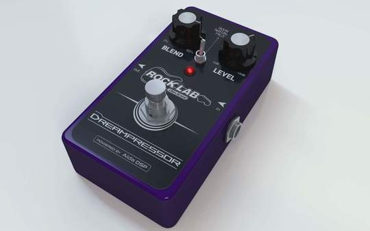

## Aida DSP Stompbox

Using the same DSP in Aida DSP Arduino Shield, _Aida DSP Stompbox_ claims to be ones of the few
fully programmable stompboxes around the world.

### Fully customizable

Are you an owner of a recording studio, an audio professional or just an audio enthusiast? With
_Aida DSP Stompbox_ we offer a product that can be customized upon request not only on the audio
algorithm part, but also on a graphic level, including your logo, your custom name for your new pedal
and more!

### Turn your audio expertise into a finalized product

- Are there some equalization schemes that you use often in your studio? So why not to put
them inside a pedal so you can use them also during rehersals or when you work on the road?
- Do you like the sound of some compressor presets that you use with your favourite plugin on your DAW? Put them
into a pedal, this will ease your job both while recording (both you or your customers) or
during production.
- Are you a producer? It's easier to convince a musician to play through a stompbox since can be used
together with their own instrumentation, but a the same time helps you in keeping that particular sound idea
that you had for their album

### Endless options and combinations

- Hammond Box die cast aluminium case, CNC machine drilled
- Flexible user interface: 2 knobs + 3-way switch or 4 knobs version
- Dual color 3mm led
- True bypass switch
- Anodized aluminium plate with laser printed graphics
- 9-12V supply center positive
- Neutrik in/out jacks with chrome ferrule nut
- Huge library with standard audio algorithms

### Solid and durable

We did a huge research among our suppliers to carefully select the components and we made a lot of prototypes before arriving at the current one.
One example? We completely redesigned the electronics to use metallic premium quality knobs screwed onto the case instead of the plastic, pcb mounting ones that were present in the first prototype.

### Partners

- [ROCK LAB](https://www.rocklab.net/)

[Go to the Home Page]({{ '/' | absolute_url }})

